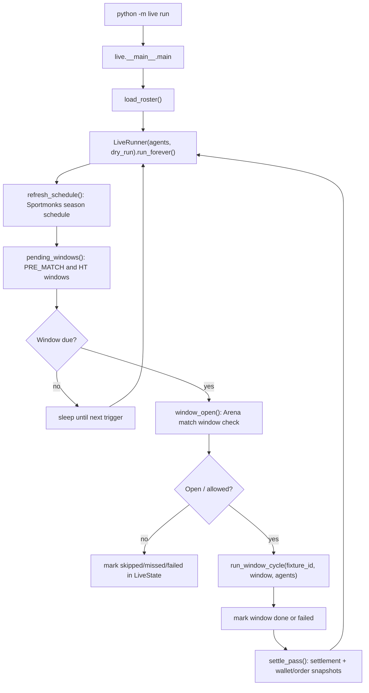
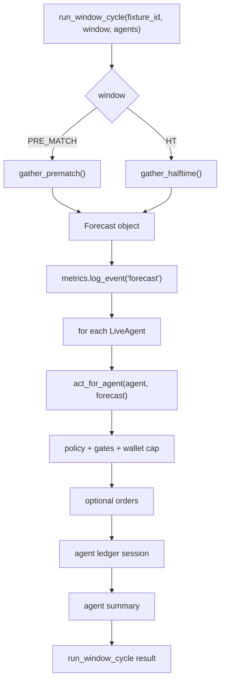
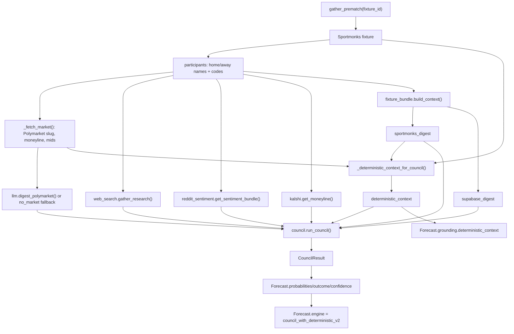
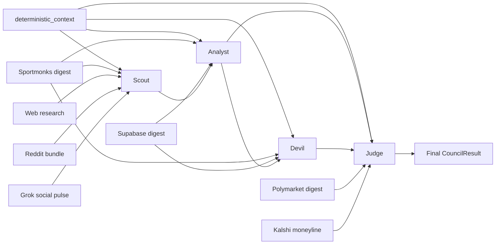
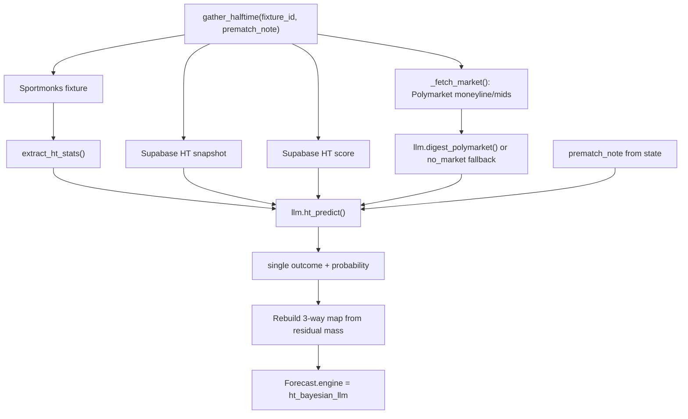
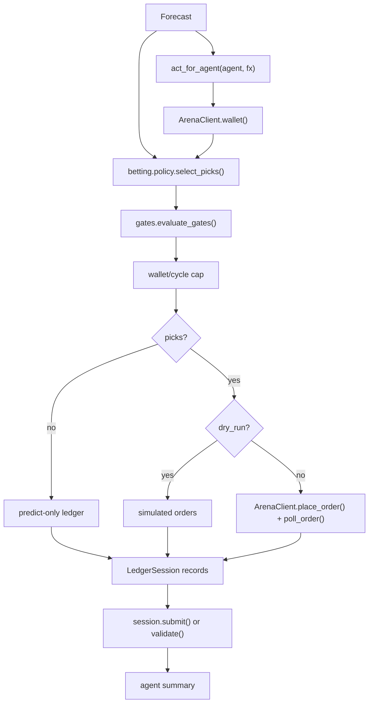
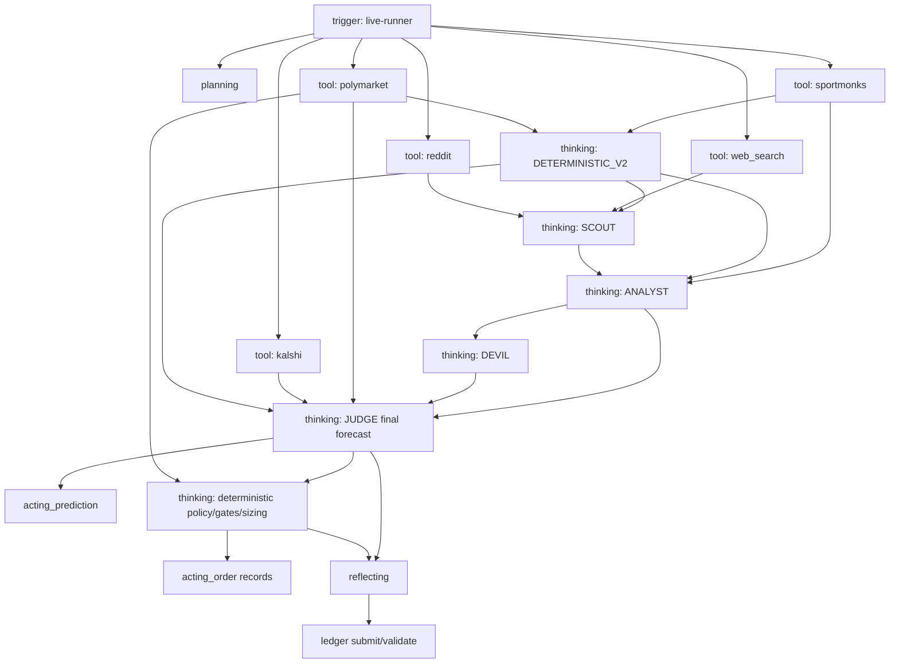
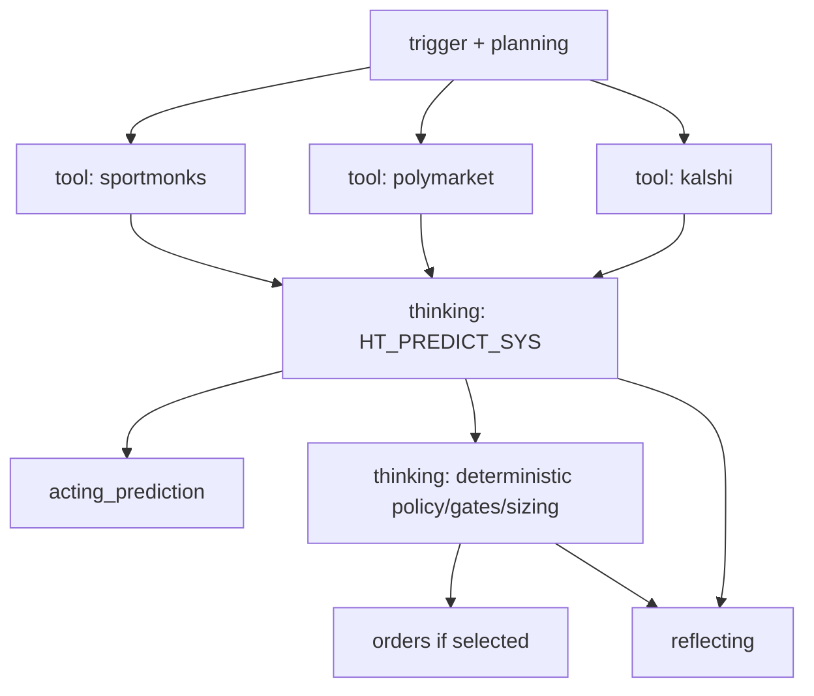

# Live Data Flow

This document describes the current live path used by:

```bash
python -m live run
```

The same core path is also used by:

```bash
python -m live once --fixture-id <id> --window PRE_MATCH
python -m live once --fixture-id <id> --window HT
```

## Top-Level Loop



## Window Cycle Shape

`run_window_cycle()` runs one shared forecast once per fixture/window, then each agent gets its own deterministic execution tail.



The shared `Forecast` is the handoff object. Its important normalized outputs are:

| Field | Meaning |
| --- | --- |
| `probabilities` | Full 3-way probability map: `{home_code, draw, away_code}`. |
| `outcome` | Highest-probability outcome. |
| `probability` | Probability of `outcome`. |
| `confidence` | `low`, `medium`, or `high`. |
| `engine` | Forecast engine label, e.g. `council_with_deterministic_v2` or `ht_bayesian_llm`. |
| `grounding` | Council grounding plus deterministic context for PRE_MATCH. |
| `summary` | Human-readable rationale from the final model step. |
| `moneyline` / `mids` | Market data used by policy/order selection. |

## PRE_MATCH Flow

PRE_MATCH is the main integrated path. The deterministic engine runs before the LLM council. Its output and generated signals are passed into the council roles. The final forecast is the council result, not a separate arbiter.



### Deterministic Engine Inputs

The deterministic path is built in `live.cycle._deterministic_v2_model()`.

| Input | Source | Use |
| --- | --- | --- |
| Polymarket mids | `_fetch_market()` | Preferred market prior if available. |
| Sportmonks bookmaker probabilities | `sportmonks.extract_bookmaker_probs()` | Fallback prior if no Polymarket prior. |
| Sportmonks ML probabilities | `sportmonks.extract_ml_probabilities()` | Fallback prior if no bookmaker prior. |
| Neutral prior | Hard-coded fallback | Used when no prior exists. |
| Stage name | Sportmonks fixture | Sets knockout/group context for deterministic_v2. |

### Deterministic Engine Outputs

The deterministic model output is stored on `Forecast.deterministic_model` and is also transformed into `deterministic_context` for the council.

| Output | Meaning |
| --- | --- |
| `probabilities` | Deterministic H/D/A probability distribution. |
| `expected_goals` | Deterministic expected goals signal. |
| `components` | Component model distributions/signals from deterministic_v2. |
| `weights` / `component_weights` | Blend weights used by deterministic_v2. |
| `blended_raw` | Raw blended distribution before final context wrapping. |
| `confidence` | Deterministic confidence score. |
| `uncertainty` | Derived uncertainty band. |
| `risk_flags` | Flags such as neutral cold start. |
| `prior_source` / `prior_hda` | Which prior was used and its normalized H/D/A map. |
| `home_state` / `away_state` | Cold-start team state passed into deterministic_v2. |
| `config` | Deterministic_v2 ensemble config. |

### LLM Council Integration



Role outputs:

| Role | Inputs | Output |
| --- | --- | --- |
| Social pulse | Fixture, teams, kickoff | Live/news/social pulse JSON. |
| Scout | Sportmonks digest, deterministic context, web, Reddit, social pulse | Flags, crowd lean, data quality. |
| Analyst | Sportmonks digest, Supabase digest, scout flags, anchor, deterministic context | Market-blind 3-way probabilities. |
| Devil | Analyst output, Sportmonks/Supabase digests, deterministic context | Counter-case and counter-probabilities. |
| Judge | Analyst, Devil, Polymarket, Kalshi, deterministic context | Final calibrated probabilities. |

The judge output becomes the PRE_MATCH forecast:

```text
Forecast.probabilities = CouncilResult.probabilities
Forecast.outcome       = CouncilResult.outcome
Forecast.probability   = CouncilResult.probability
Forecast.confidence    = CouncilResult.confidence
Forecast.engine        = "council_with_deterministic_v2"
```

## HT Flow

HT uses the existing half-time Bayesian LLM update path. It does not run the PRE_MATCH council again.



HT forecast outputs are the same normalized `Forecast` fields consumed by policy and orders.

## Per-Agent Tail

After the shared forecast is built, every configured agent runs the same tail with its own profile, wallet, API key, orders, and ledger.



Policy inputs:

| Input | Source |
| --- | --- |
| Forecast probabilities | Council+deterministic PRE_MATCH or HT Bayesian update. |
| Market moneyline/mids | Polymarket fetch. |
| Agent profile | `live.roster` / `harness.profiles`. |
| Wallet balance | Arena wallet endpoint. |
| Confidence | Forecast confidence converted with `confidence_to_num()`. |
| Scout flags | PRE_MATCH council scout flags, empty for HT unless populated upstream. |

Agent outputs:

| Output | Meaning |
| --- | --- |
| `prediction` | Outcome, probability, full probabilities, confidence, engine. |
| `orders` | Placed/simulated order summaries. |
| `skip_reasons` | Why no trade or why picks were filtered. |
| `ledger` | Ledger submit/validate result. |
| `session_id` | Per-agent reasoning-ledger session id. |

## Ledger DAG

PRE_MATCH ledger records include deterministic_v2 as an explicit upstream reasoning step.



HT ledger records use the HT predictor as the final forecast step:



## Metrics And State Outputs

| Output | Writer | Contents |
| --- | --- | --- |
| `metrics.log_event("forecast")` | `run_window_cycle()` | Fixture, window, engine, probabilities, confidence, market source, grounding, summary. |
| `metrics.log_event("agent_window")` | `act_for_agent()` | Agent profile, engine, prediction, wallet, orders, skip reasons, ledger result. |
| `storage/live/state.json` | `LiveState` | Window status, agent summaries, retries, settlement status. |
| Ledger API | `LedgerSession` | Per-agent reasoning DAG and action trace. |
| Arena orders | `ArenaClient.place_order()` | Live or simulated orders depending on `--dry-run`. |

## Current Engine Summary

| Window | Forecast engine | Deterministic_v2 used? | Final forecast owner |
| --- | --- | --- | --- |
| `PRE_MATCH` | `council_with_deterministic_v2` | Yes. Full deterministic context is passed to Scout, Analyst, Devil, and Judge. | LLM council Judge result after grounding. |
| `HT` | `ht_bayesian_llm` | No separate deterministic_v2 run in the current HT path. | HT Bayesian LLM update, then residual 3-way reconstruction. |

